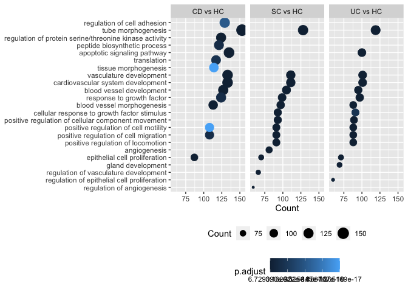

Gene set enrichment analysis of differentially expressed genes
================

Load prerequisites that will be needed for gene set enrichment analysis
(GSEA) in R environment.

``` r
# libraries
library(tidyverse)
library(clusterProfiler)
library(org.Hs.eg.db)
library(multiMiR)
```

Read results of differential gene expression, which were generated using
microrna\_dea.Rmd and microarray\_dea.Rmd.

``` r
# set wd to main
setwd('..')

# dea results
dea_res_list <- 
  list.files(
    path = paste0(getwd(),"/results"),
    pattern = "dea_results.tsv",
    full.names = TRUE
    ) 

dea_res <- lapply(dea_res_list, read_tsv)
names(dea_res) <- str_extract(
  dea_res_list, ".e_.*_dea"
)
dea_res
```

    ## $de_mirna_dea
    ## # A tibble: 1,662 × 11
    ##    Symbol  logFC   CI.L   CI.R AveExpr     t  P.Value adj.P.Val     B comparison
    ##    <chr>   <dbl>  <dbl>  <dbl>   <dbl> <dbl>    <dbl>     <dbl> <dbl> <chr>     
    ##  1 hsa-mi… -1.44 -1.93  -0.954   3.96  -5.81 1.90e- 8   7.53e-7  8.97 CD vs HC  
    ##  2 hsa-mi… -1.42 -1.85  -0.984   8.67  -6.44 6.14e-10   3.78e-8 12.2  CD vs HC  
    ##  3 hsa-mi… -1.41 -1.96  -0.854  -0.721 -5.01 1.04e- 6   2.21e-5  5.26 CD vs HC  
    ##  4 hsa-mi… -1.36 -1.76  -0.963   0.392 -6.72 1.27e-10   2.81e-8 13.7  CD vs HC  
    ##  5 hsa-mi… -1.35 -1.87  -0.826   0.891 -5.07 7.83e- 7   1.87e-5  5.55 CD vs HC  
    ##  6 hsa-mi… -1.26 -1.67  -0.855   3.07  -6.09 4.26e- 9   1.97e-7 10.4  CD vs HC  
    ##  7 hsa-mi…  1.23  0.714  1.74    3.44   4.72 4.02e- 6   6.36e-5  3.88 CD vs HC  
    ##  8 hsa-mi… -1.22 -1.59  -0.851   5.62  -6.51 4.29e-10   3.78e-8 12.6  CD vs HC  
    ##  9 hsa-mi… -1.21 -1.69  -0.740   4.89  -5.05 8.60e- 7   1.91e-5  5.30 CD vs HC  
    ## 10 hsa-mi… -1.15 -1.53  -0.771   8.45  -5.99 7.37e- 9   3.14e-7  9.81 CD vs HC  
    ## # … with 1,652 more rows, and 1 more variable: dea <chr>
    ## 
    ## $se_mirna_dea
    ## # A tibble: 3,198 × 11
    ##    Symbol logFC   CI.L   CI.R AveExpr      t  P.Value adj.P.Val     B comparison
    ##    <chr>  <dbl>  <dbl>  <dbl>   <dbl>  <dbl>    <dbl>     <dbl> <dbl> <chr>     
    ##  1 hsa-m… -5.20 -5.84  -4.55   -1.20  -15.8  1.32e-36  7.02e-34 71.5  CD vs HC  
    ##  2 hsa-m… -2.45 -3.06  -1.84    4.46   -7.95 1.53e-13  2.72e-11 20.2  CD vs HC  
    ##  3 hsa-m… -1.99 -2.50  -1.48    3.53   -7.72 6.29e-13  6.70e-11 18.8  CD vs HC  
    ##  4 hsa-m… -1.97 -2.53  -1.42    6.19   -7.00 4.25e-11  2.52e- 9 14.7  CD vs HC  
    ##  5 hsa-m… -1.72 -2.43  -1.01    0.411  -4.78 3.46e- 6  3.88e- 5  4.01 CD vs HC  
    ##  6 hsa-m…  1.61  1.16   2.06    1.36    7.13 2.02e-11  1.34e- 9 15.6  CD vs HC  
    ##  7 hsa-m…  1.45  0.906  2.00   -0.790   5.22 4.53e- 7  7.31e- 6  6.05 CD vs HC  
    ##  8 hsa-m… -1.44 -2.01  -0.866   2.08   -4.95 1.63e- 6  2.12e- 5  4.57 CD vs HC  
    ##  9 hsa-m… -1.41 -1.89  -0.925   7.57   -5.75 3.39e- 8  7.24e- 7  8.14 CD vs HC  
    ## 10 hsa-m… -1.40 -1.89  -0.917  -1.92   -5.69 4.66e- 8  9.19e- 7  8.21 CD vs HC  
    ## # … with 3,188 more rows, and 1 more variable: dea <chr>
    ## 
    ## $se_rna_dea
    ## # A tibble: 70,350 × 14
    ##    Probe_Id     Array_Address_Id Symbol   ENTREZ logFC  CI.L  CI.R AveExpr     t
    ##    <chr>                   <dbl> <chr>     <dbl> <dbl> <dbl> <dbl>   <dbl> <dbl>
    ##  1 ILMN_1651358          4830541 HBE1     3.05e3  2.61  2.19  3.02   11.6  12.3 
    ##  2 ILMN_1694548           240594 ANXA3    3.06e2  2.06  1.65  2.47    8.95  9.90
    ##  3 ILMN_1664706          4570725 H3C13    6.54e5  1.97  1.66  2.28    7.25 12.6 
    ##  4 ILMN_2387385          3290368 IGFBP1   3.48e3  1.87  1.49  2.24    8.39  9.74
    ##  5 ILMN_1748915          1410221 S100A12  6.28e3  1.82  1.47  2.16   11.1  10.3 
    ##  6 ILMN_1724533            70167 LY96     2.36e4  1.78  1.43  2.14    9.14  9.95
    ##  7 ILMN_2184049          2260576 COX7B    1.35e3  1.74  1.33  2.15    7.04  8.37
    ##  8 ILMN_1816342          1230164 MTRNR2L1 1.00e8  1.67  1.41  1.92    7.83 13.0 
    ##  9 ILMN_1777378          4260484 COMMD6   1.71e5  1.64  1.18  2.10    8.45  7.07
    ## 10 ILMN_2183216          3310161 TDP2     5.16e4  1.53  1.10  1.96    6.94  7.05
    ## # … with 70,340 more rows, and 5 more variables: P.Value <dbl>,
    ## #   adj.P.Val <dbl>, B <dbl>, comparison <chr>, dea <chr>

GSEA for deferentially expressed genes and microRNAs was performed using
in blood expressed genes as a universe for over-representation analysis
(ORA).

``` r
# all expressed genes in peripheral blood dataset
expressed_genes <- dea_res$se_rna_dea %>% 
  dplyr::select(
    Symbol, ENTREZ
  ) %>% distinct() %>% 
  mutate(
    ENTREZID=as.character(ENTREZ)
    )

# print number of genes
nrow(expressed_genes)
```

    ## [1] 11725

GSEA of deferentially expressed genes using GO terms (treatment-naive
cohort):

``` r
# get deferentially expressed genes
se_dea_gene_list <- dea_res$se_rna_dea %>%
  filter(dea %in% "de") %>% 
  split(., f = .$comparison) %>%
  lapply(., function(x){
    x %>% dplyr::select(Symbol, ENTREZ) %>% 
      mutate(ENTREZID = as.character(ENTREZ))
    })

# remove empty elements (such as CD vs UC)
se_dea_gene_list <- compact(se_dea_gene_list)

# print de genes
lapply(se_dea_gene_list, nrow)
```

    ## $`CD vs HC`
    ## [1] 617
    ## 
    ## $`CD vs SC`
    ## [1] 40
    ## 
    ## $`SC vs HC`
    ## [1] 147
    ## 
    ## $`UC vs HC`
    ## [1] 480
    ## 
    ## $`UC vs SC`
    ## [1] 30

``` r
# perform run over-representation analysis
# using expressed genes as universe
se_dea_gene_go <- lapply(
  se_dea_gene_list, function(x) {
    enrichGO(
      gene = x$ENTREZID,
      OrgDb = org.Hs.eg.db,
      ont = "BP",
      pAdjustMethod = "BH",
      universe = expressed_genes$ENTREZID
      )
  })

# combine results to table for plotting
se_dea_gene_go_tb <- lapply(
  se_dea_gene_go, function(x){
     x %>% .@result  }
  ) %>% bind_rows(.id = "comparison") %>% 
  filter(p.adjust<0.05)

# visualize top sig terms
se_dea_gene_go_tb %>% 
  group_by(comparison) %>%
  top_n(-15, wt=p.adjust) %>% 
  ggplot(aes(x = Count, y = fct_reorder(Description, Count))) + 
  geom_point(aes(size = Count, color = p.adjust)) +
  facet_wrap(~comparison, nrow = 1) + ylab(NULL) +
  theme(legend.position = "bottom",
        legend.direction = "horizontal",
        legend.box = "vertical")
```

<!-- -->

GSEA of validated target genes of deferentially expressed miRNAs.
Analysis was performed using target genes, that are found to be
expressed in blood (using microarray data to define expression status).
The miRTarbase was was accessed via multiMiR package.

Treatment-naive Swedish (se) cohort:

``` r
# get deferentially expressed mirna
se_dea_mir_list <- dea_res$se_mirna_dea %>%
  filter(dea %in% "de") %>% 
  split(., f = .$comparison) %>%
  lapply(., function(x){x %>% .$Symbol})

# remove empty elements (such as CD vs UC)
se_dea_mir_list <- compact(se_dea_mir_list)

# print de mir
lapply(se_dea_mir_list, length)
```

    ## $`CD vs HC`
    ## [1] 116
    ## 
    ## $`SC vs HC`
    ## [1] 95
    ## 
    ## $`UC vs HC`
    ## [1] 101

``` r
# validated MTIs for all comparisons
se_mirtar_list <- 
  lapply(se_dea_mir_list, function(x){
    y <- get_multimir(
      org = "hsa",
      mirna = x,
      target = expressed_genes$ENTREZID,
      table = "mirtarbase",
      summary = TRUE)
    return(y@data)
})
```

    ## Searching mirtarbase ...
    ## Searching mirtarbase ...
    ## Searching mirtarbase ...

``` r
# filter MTIs based on experiment type
se_mirtar_list_filt <- lapply(se_mirtar_list, function(x){
  x %>% filter(
    grepl("Luciferase|Western|pSILAC|Proteomics", experiment)
    )
  })

# run over-representation analysis
# using expressed genes as universe
se_mirtar_go <- lapply(se_mirtar_list_filt, function(x){
  enrichGO(
    gene = unique(x$target_entrez),
    OrgDb = org.Hs.eg.db,
    ont = "BP",
    pAdjustMethod = "BH",
    universe = expressed_genes$ENTREZID
    )
})

# flatten results to table
se_mirtar_go_tb <- lapply(
  se_mirtar_go, function(x) x %>% .@result
  ) %>% bind_rows(.id = "comparison") %>% 
  filter(p.adjust<0.05)

# visualize
se_mirtar_go_tb %>% 
  group_by(comparison) %>% 
  top_n(-15, wt=p.adjust) %>% 
  ggplot(aes(x = Count, y = fct_reorder(Description, Count))) + 
  geom_point(aes(size = Count, color = p.adjust)) +
  facet_wrap(~comparison, nrow = 1) + ylab(NULL) +
  theme(legend.position = "bottom",
        legend.direction = "horizontal",
        legend.box = "vertical")
```

<!-- -->

Treatment-receiving German (de) cohort:

``` r
# get deferentially expressed mirna
de_dea_mir_list <- dea_res$de_mirna_dea %>%
  filter(dea %in% "de") %>% 
  split(., f = .$comparison) %>%
  lapply(., function(x){x %>% .$Symbol})

# remove empty elements (such as CD vs UC)
de_dea_mir_list <- compact(de_dea_mir_list)

# print de mir
lapply(de_dea_mir_list, length)
```

    ## $`CD vs HC`
    ## [1] 71
    ## 
    ## $`UC vs HC`
    ## [1] 57

``` r
# validated MTIs for all comparisons
de_mirtar_list <- 
  lapply(de_dea_mir_list, function(x){
    y <- get_multimir(
      org = "hsa",
      mirna = x,
      target = expressed_genes$ENTREZID,
      table = "mirtarbase",
      summary = TRUE)
    return(y@data)
})
```

    ## Searching mirtarbase ...
    ## Searching mirtarbase ...

``` r
# filter MTIs based on experiment type
de_mirtar_list_filt <- lapply(de_mirtar_list, function(x){
  x %>% filter(
    grepl("Luciferase|Western|pSILAC|Proteomics", experiment)
    )
})

# run enrichment analysis
de_mirtar_go <- lapply(de_mirtar_list_filt, function(x){
  enrichGO(
    gene = unique(x$target_entrez),
    OrgDb = org.Hs.eg.db,
    ont = "BP",
    pAdjustMethod = "BH",
    universe = expressed_genes$ENTREZID
    )
})

# flatten results to table
de_mirtar_go_tb <- lapply(
  de_mirtar_go, function(x) x %>% .@result
  ) %>% bind_rows(.id = "comparison") %>% 
  filter(p.adjust<0.05)

# visualize
de_mirtar_go_tb %>%
  group_by(comparison) %>%
  top_n(-15, wt=p.adjust) %>% 
  ggplot(aes(x = Count, y = fct_reorder(Description, Count))) + 
  geom_point(aes(size = Count, color = p.adjust)) +
  facet_wrap(~comparison, nrow = 1) + ylab(NULL) +
  theme(legend.position = "bottom",
        legend.direction = "horizontal",
        legend.box = "vertical")
```

<!-- -->

Enriched MTI pathways that are overlapping with DEG most (top 20)
enriched pathways:

``` r
# overlapping paths
over_paths <- left_join(
  se_dea_gene_go_tb %>% 
    group_by(comparison) %>% 
    top_n(-25, wt=p.adjust) %>% 
    ungroup(),
  se_mirtar_go_tb,
  by = c("comparison", "ID", "Description")
  ) %>% 
  rename_all(
    ~gsub(".x", "_semrna", .x, fixed=TRUE)
    ) %>% 
  rename_all(
    ~gsub(".y", "_semirna", .x, fixed=TRUE)
    ) %>% 
  left_join(
    ., de_mirtar_go_tb %>% 
      rename_at(
        vars(GeneRatio:Count), funs(paste0(., "_demirna"))
        ),
    by = c("comparison", "ID", "Description")
    ) %>% 
  pivot_longer(
    cols = -c(comparison, ID, Description),
    names_to = c( '.value', 'grp'),
    names_pattern = "^(.*_)(.*)"
    ) %>% 
  rename_all(
    ~gsub("_", "", .x)
    )

# visualize
over_paths %>% rowwise() %>% 
  mutate(GeneRatio=eval(parse(text=GeneRatio[1]))) %>%
  mutate(grp = factor(grp, levels = c("semrna", "semirna", "demirna"))) %>% 
  ggplot(aes(x = comparison, y = Description)) + 
  geom_point(aes(size = GeneRatio, color = p.adjust)) +
  facet_grid(.~grp, scales = "free_x", space = "free") +
  ylab(NULL)
```

<!-- -->

``` r
sessionInfo()
```

    ## R version 4.0.2 (2020-06-22)
    ## Platform: x86_64-apple-darwin17.0 (64-bit)
    ## Running under: macOS  10.16
    ## 
    ## Matrix products: default
    ## BLAS:   /Library/Frameworks/R.framework/Versions/4.0/Resources/lib/libRblas.dylib
    ## LAPACK: /Library/Frameworks/R.framework/Versions/4.0/Resources/lib/libRlapack.dylib
    ## 
    ## locale:
    ## [1] en_US.UTF-8/en_US.UTF-8/en_US.UTF-8/C/en_US.UTF-8/en_US.UTF-8
    ## 
    ## attached base packages:
    ## [1] parallel  stats4    stats     graphics  grDevices utils     datasets 
    ## [8] methods   base     
    ## 
    ## other attached packages:
    ##  [1] multiMiR_1.10.0        org.Hs.eg.db_3.11.4    AnnotationDbi_1.50.3  
    ##  [4] IRanges_2.22.2         S4Vectors_0.26.1       Biobase_2.48.0        
    ##  [7] BiocGenerics_0.34.0    clusterProfiler_3.16.1 forcats_0.5.1         
    ## [10] stringr_1.4.0          dplyr_1.0.7            purrr_0.3.4           
    ## [13] readr_2.1.0            tidyr_1.1.4            tibble_3.1.6          
    ## [16] ggplot2_3.3.5          tidyverse_1.3.1       
    ## 
    ## loaded via a namespace (and not attached):
    ##   [1] fgsea_1.14.0        colorspace_2.0-2    ellipsis_0.3.2     
    ##   [4] ggridges_0.5.3      qvalue_2.20.0       fs_1.5.0           
    ##   [7] rstudioapi_0.13     farver_2.1.0        urltools_1.7.3     
    ##  [10] graphlayouts_0.7.2  ggrepel_0.9.1       bit64_4.0.5        
    ##  [13] scatterpie_0.1.7    fansi_0.5.0         lubridate_1.8.0    
    ##  [16] xml2_1.3.2          splines_4.0.2       cachem_1.0.6       
    ##  [19] GOSemSim_2.14.2     knitr_1.36          polyclip_1.10-0    
    ##  [22] jsonlite_1.7.2      broom_0.7.10        GO.db_3.11.4       
    ##  [25] dbplyr_2.1.1        ggforce_0.3.3       BiocManager_1.30.16
    ##  [28] compiler_4.0.2      httr_1.4.2          rvcheck_0.2.1      
    ##  [31] backports_1.4.0     assertthat_0.2.1    Matrix_1.3-4       
    ##  [34] fastmap_1.1.0       cli_3.1.0           tweenr_1.0.2       
    ##  [37] htmltools_0.5.2     prettyunits_1.1.1   tools_4.0.2        
    ##  [40] igraph_1.2.5        gtable_0.3.0        glue_1.5.0         
    ##  [43] reshape2_1.4.4      DO.db_2.9           fastmatch_1.1-3    
    ##  [46] Rcpp_1.0.7          enrichplot_1.8.1    cellranger_1.1.0   
    ##  [49] vctrs_0.3.8         ggraph_2.0.5        xfun_0.28          
    ##  [52] rvest_1.0.2         lifecycle_1.0.1     XML_3.99-0.8       
    ##  [55] DOSE_3.14.0         europepmc_0.4.1     MASS_7.3-54        
    ##  [58] scales_1.1.1        tidygraph_1.2.0     vroom_1.5.6        
    ##  [61] hms_1.1.1           RColorBrewer_1.1-2  yaml_2.2.1         
    ##  [64] memoise_2.0.0       gridExtra_2.3       ggfun_0.0.4        
    ##  [67] downloader_0.4      yulab.utils_0.0.4   triebeard_0.3.0    
    ##  [70] stringi_1.7.5       RSQLite_2.2.8       highr_0.9          
    ##  [73] BiocParallel_1.22.0 bitops_1.0-7        rlang_0.4.12       
    ##  [76] pkgconfig_2.0.3     evaluate_0.14       lattice_0.20-45    
    ##  [79] labeling_0.4.2      cowplot_1.1.1       bit_4.0.4          
    ##  [82] tidyselect_1.1.1    plyr_1.8.6          magrittr_2.0.1     
    ##  [85] R6_2.5.1            generics_0.1.1      DBI_1.1.1          
    ##  [88] pillar_1.6.4        haven_2.4.3         withr_2.4.2        
    ##  [91] RCurl_1.98-1.5      modelr_0.1.8        crayon_1.4.2       
    ##  [94] utf8_1.2.2          tzdb_0.2.0          rmarkdown_2.11     
    ##  [97] viridis_0.6.2       progress_1.2.2      grid_4.0.2         
    ## [100] readxl_1.3.1        data.table_1.14.2   blob_1.2.2         
    ## [103] reprex_2.0.1        digest_0.6.28       gridGraphics_0.5-1 
    ## [106] munsell_0.5.0       viridisLite_0.4.0   ggplotify_0.1.0
