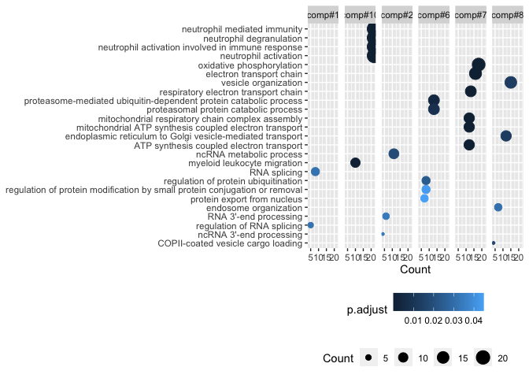

Functional annotation of co-expression components
================

Load prerequisites that will be needed for gene set enrichment analysis
(GSEA) in R environment. NOTE: here we use conda environment, which
contains [kneed](https://kneed.readthedocs.io/en/stable/) python
package. The package will be used to obtain lead driving genes of each
co-expression component.

``` r
# libraries
library(tidyverse)
library(clusterProfiler)
library(org.Hs.eg.db)
library(reticulate)

## define Python, which contain kneed
## please change this depending on your env
use_condaenv(
  condaenv = "reticulate_env",
  required = TRUE
  )
# import kneed
kneed <- import("kneed")
```

Read results of nonnegative CP tensor decomposition, which were
generated using 5\_wgcna\_tensor\_decomp.ipynb:

``` r
# set wd to main
setwd('..')

# components results
component_list <- 
  list.files(
    path = paste0(getwd(), "/results"),
    pattern = "factor.csv",
    full.names = TRUE
  )
names(component_list) <- str_extract(component_list, "[A-C]_factor")

# read
component_list <- lapply(
  component_list,
  read_csv,
  col_names=c(
    "var", paste0("comp#",1:10)
  )
  )
```

Knee point determination to identify the lead driving genes:

``` r
# use scores of A latent matrix
A <- component_list$A_factor %>%
  gather(comp, score, -var) %>% 
  split(.$comp)

# sort and add order
A <- lapply(A, function(j){
  j %>% arrange(desc(score)) %>% 
    mutate(order = rep(1:n()))
  })

# calculate knee points
A_knee <- lapply(A, function(j){
  kneed$KneeLocator(
    x= j[,4, drop=T],
    y= j[,3, drop=T],
    S = 1,
    curve='convex',
    direction='decreasing'
    ) %>% .$knee
  })
```

Functional annotation of co-expression components using GSEA:

``` r
# get gene lists
component_knee_genes <- 
  lapply(seq(A), function(i){
    A[[i]] %>% filter(A_knee[[i]] >= order) %>% 
      pull(var) %>%
      bitr(.,
           fromType="SYMBOL",
           toType="ENTREZID",
           OrgDb = org.Hs.eg.db,
           drop = TRUE
           )
})
names(component_knee_genes) <- names(A)

# run enrichment analysis
component_knee_go <- 
  lapply(component_knee_genes, function(x){
    enrichGO(
      gene = x$ENTREZID,
      OrgDb = org.Hs.eg.db,
      ont = "BP",
      pAdjustMethod = "BH", 
      pvalueCutoff  = 0.05,
      qvalueCutoff  = 0.05
      )
    })

# flatten results to table
component_knee_go_tb <- lapply(
  component_knee_go, function(x) x %>% .@result
  ) %>% bind_rows(.id = "component") %>%
  filter(p.adjust<0.05) %>%
  group_by(component) %>%
  top_n(-5, wt=p.adjust)

# visualize
component_knee_go_tb %>% 
  ggplot(aes(x = Count, y = fct_reorder(Description, Count))) + 
  geom_point(aes(size = Count, color = p.adjust)) +
  facet_wrap(~component, nrow = 1) + ylab(NULL) +
  theme(legend.position = "bottom",
        legend.direction = "horizontal",
        legend.box = "vertical")
```

<!-- -->

``` r
sessionInfo()
```

    ## R version 4.0.2 (2020-06-22)
    ## Platform: x86_64-apple-darwin17.0 (64-bit)
    ## Running under: macOS  10.16
    ## 
    ## Matrix products: default
    ## BLAS:   /Library/Frameworks/R.framework/Versions/4.0/Resources/lib/libRblas.dylib
    ## LAPACK: /Library/Frameworks/R.framework/Versions/4.0/Resources/lib/libRlapack.dylib
    ## 
    ## locale:
    ## [1] en_US.UTF-8/en_US.UTF-8/en_US.UTF-8/C/en_US.UTF-8/en_US.UTF-8
    ## 
    ## attached base packages:
    ## [1] parallel  stats4    stats     graphics  grDevices utils     datasets 
    ## [8] methods   base     
    ## 
    ## other attached packages:
    ##  [1] reticulate_1.16-9001   org.Hs.eg.db_3.11.4    AnnotationDbi_1.50.1  
    ##  [4] IRanges_2.22.2         S4Vectors_0.26.1       Biobase_2.48.0        
    ##  [7] BiocGenerics_0.34.0    clusterProfiler_3.16.0 forcats_0.5.0         
    ## [10] stringr_1.4.0          dplyr_1.0.0            purrr_0.3.4           
    ## [13] readr_1.3.1            tidyr_1.1.3            tibble_3.0.3          
    ## [16] ggplot2_3.3.2          tidyverse_1.3.0       
    ## 
    ## loaded via a namespace (and not attached):
    ##  [1] fgsea_1.14.0        colorspace_1.4-1    ellipsis_0.3.1     
    ##  [4] ggridges_0.5.2      qvalue_2.20.0       fs_1.4.2           
    ##  [7] rstudioapi_0.11     farver_2.0.3        urltools_1.7.3     
    ## [10] graphlayouts_0.7.0  ggrepel_0.9.0.9999  bit64_0.9-7        
    ## [13] fansi_0.4.1         scatterpie_0.1.4    lubridate_1.7.9    
    ## [16] xml2_1.3.2          splines_4.0.2       GOSemSim_2.14.0    
    ## [19] knitr_1.29          polyclip_1.10-0     jsonlite_1.7.2     
    ## [22] broom_0.7.0         GO.db_3.11.4        dbplyr_1.4.4       
    ## [25] ggforce_0.3.2       BiocManager_1.30.10 compiler_4.0.2     
    ## [28] httr_1.4.1          rvcheck_0.1.8       backports_1.1.8    
    ## [31] assertthat_0.2.1    Matrix_1.2-18       cli_2.0.2          
    ## [34] tweenr_1.0.1        htmltools_0.5.0     prettyunits_1.1.1  
    ## [37] tools_4.0.2         igraph_1.2.5        gtable_0.3.0       
    ## [40] glue_1.4.1          reshape2_1.4.4      DO.db_2.9          
    ## [43] fastmatch_1.1-0     Rcpp_1.0.6          enrichplot_1.8.1   
    ## [46] cellranger_1.1.0    vctrs_0.3.8         ggraph_2.0.3       
    ## [49] xfun_0.19           rvest_0.3.6         lifecycle_0.2.0    
    ## [52] DOSE_3.14.0         europepmc_0.4       MASS_7.3-51.6      
    ## [55] scales_1.1.1        tidygraph_1.2.0     hms_0.5.3          
    ## [58] RColorBrewer_1.1-2  yaml_2.2.1          memoise_1.1.0      
    ## [61] gridExtra_2.3       downloader_0.4      triebeard_0.3.0    
    ## [64] stringi_1.4.6       RSQLite_2.2.0       BiocParallel_1.22.0
    ## [67] rlang_0.4.11        pkgconfig_2.0.3     evaluate_0.14      
    ## [70] lattice_0.20-41     labeling_0.3        cowplot_1.0.0      
    ## [73] bit_1.1-15.2        tidyselect_1.1.0    plyr_1.8.6         
    ## [76] magrittr_1.5        R6_2.4.1            generics_0.0.2     
    ## [79] DBI_1.1.0           pillar_1.4.6        haven_2.3.1        
    ## [82] withr_2.4.2         modelr_0.1.8        crayon_1.3.4       
    ## [85] rmarkdown_2.3       viridis_0.5.1       progress_1.2.2     
    ## [88] grid_4.0.2          readxl_1.3.1        data.table_1.12.8  
    ## [91] blob_1.2.1          reprex_0.3.0        digest_0.6.25      
    ## [94] gridGraphics_0.5-0  munsell_0.5.0       viridisLite_0.3.0  
    ## [97] ggplotify_0.0.5
