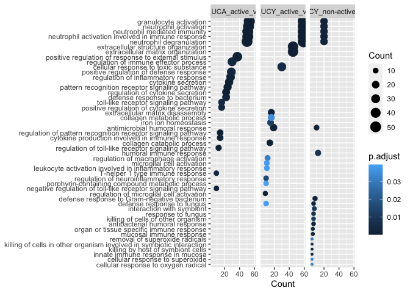

Gene set enrichment analysis of differentially expressed genes from
Ostrowski et al 2019
================

Load prerequisites that will be needed for gene set enrichment analysis
(GSEA) in R environment.

``` r
# libraries
library(tidyverse)
library(clusterProfiler)
library(org.Hs.eg.db)
library(biomaRt)
library(openxlsx)

# load Ensembl database for gene mapping
ensembl <- useEnsembl(
  biomart = "genes"
  )
ensembl <- useDataset(
  dataset = "hsapiens_gene_ensembl",
  mart = ensembl
  )
```

Read results of differential gene expression, which were obtained from
[Ostrowski et al, 2019](https://doi.org/10.1093/ecco-jcc/jjy205)

``` r
###
### first manually download the Supplementary Table S2 
### from https://doi.org/10.1093/ecco-jcc/jjy205

# set wd to main
setwd('..')

# dea results
sheet_names <- getSheetNames("data/jjy205_suppl_supplementary_table_s2.xlsx")

dea_res_list <- lapply(sheet_names, function(x){
  read.xlsx(
    "data/jjy205_suppl_supplementary_table_s2.xlsx",
    sheet = x
  )
})
names(dea_res_list) <- sheet_names

# print
lapply(dea_res_list, head)
```

    ## $Legend
    ## [1] Supplementary.table.S2:.Tables.represent.full.results.for.comparisons.of.choice,.presented.in.Table.2.of.the.article..The.legend.is.the.same.for.all.the.tables.and.is.as.following:.gene.-.gene.name.is.given.according.to.the.AmpliSeq.reference.files.(version.1).downloaded.from.www.ampliseq.com.;.baseMean.-.mean.gene.expresssion.;.log2FoldChange.-.logarithm.with.base.2.from.fold-change.;.stat.-.Wald.test.statistic.;.pvalue.-.P-value.in.Wald.test.;.padj.-.adjusted.P-value.with.Benjamini-Hochberg.method.;.FC.-.fold-change..Group.symbols.are.as.follows:.CD.-.Crohn's.disease.;.UC.-.ulcerative.colitis.;.Y.-.pediatric.onset.;.A.-.adult.onset.;.C.-.control.
    ## <0 rows> (or 0-length row.names)
    ## 
    ## $CDY_UCY_active_vs_CY
    ##     gene    baseMean log2FoldChange       stat       pvalue         padj
    ## 1  RPPH1  5803.57571     -1.1867705 -10.049286 9.253514e-24 9.487362e-20
    ## 2  EID2B    24.35370      0.8959524  10.032480 1.097249e-23 9.487362e-20
    ## 3 EXOSC1   892.93327     -0.7657992  -9.685285 3.482373e-22 2.007356e-18
    ## 4   RMRP 22806.44555     -0.8862145  -9.552355 1.267811e-21 5.481062e-18
    ## 5 RAD23A  1917.03753     -1.1835355  -9.474808 2.672525e-21 9.243195e-18
    ## 6  THEM5    62.34468     -2.1438046  -9.436220 3.864710e-21 1.113874e-17
    ##          FC
    ## 1 0.4392851
    ## 2 1.8608379
    ## 3 0.5881275
    ## 4 0.5410319
    ## 5 0.4402712
    ## 6 0.2262823
    ## 
    ## $`CDY_UCY_non-active_vs_CY`
    ##       gene   baseMean log2FoldChange      stat       pvalue         padj
    ## 1     RMRP 22787.8239     -0.8926485 -9.789676 1.246953e-22 1.807833e-18
    ## 2   EXOSC1   853.3131     -0.6634290 -8.480895 2.234674e-17 1.619915e-13
    ## 3    RPPH1  5640.0692     -1.0771194 -8.045113 8.616597e-16 4.164114e-12
    ## 4 XRCC6BP1   286.5033     -1.1004806 -7.777157 7.417239e-15 2.150703e-11
    ## 5     FNTA  3026.8532     -1.0135160 -7.779372 7.288520e-15 2.150703e-11
    ## 6   RAD23A  1539.1783     -0.7677084 -7.669848 1.722005e-14 4.160939e-11
    ##          FC
    ## 1 0.5386244
    ## 2 0.6313759
    ## 3 0.4739743
    ## 4 0.4663611
    ## 5 0.4953376
    ## 6 0.5873497
    ## 
    ## $CDY_vs_UCY
    ##       gene  baseMean log2FoldChange      stat      pvalue      padj        FC
    ## 1     GLCE  42.33638     -0.3918882 -4.381443 0.000011800 0.1180375 0.7621315
    ## 2    NLRP3 146.70531     -0.3563644 -4.466112 0.000007970 0.1180375 0.7811306
    ## 3    OR6K3  16.26562      0.4583296  3.961911 0.000074400 0.3398196 1.3739501
    ## 4 HIST1H3B 739.65457      0.4377670  3.848601 0.000118794 0.3398196 1.3545062
    ## 5  POU2AF1 972.80395      0.4306040  3.905571 0.000094000 0.3398196 1.3477977
    ## 6   NT5DC2  92.59413      0.4264333  3.864948 0.000111113 0.3398196 1.3439070
    ## 
    ## $CDA_UCA_active_vs_CA
    ##      gene  baseMean log2FoldChange     stat       pvalue         padj       FC
    ## 1    MSL3  643.2704      0.7152537 6.944788 3.790282e-12 5.564892e-08 1.641772
    ## 2 S100A12 8953.0376      1.2844763 4.967837 6.770373e-07 1.120484e-04 2.435936
    ## 3   ACSL1 4194.8388      1.1141071 5.179481 2.225046e-07 4.875839e-05 2.164610
    ## 4    MMP9 2925.5700      1.3279889 4.985398 6.183437e-07 1.055642e-04 2.510525
    ## 5    CST7 2196.6911      1.1011374 5.695873 1.227420e-08 6.214129e-06 2.145238
    ## 6    PYGL 2124.6225      1.0940774 5.398170 6.732417e-08 2.133711e-05 2.134765
    ## 
    ## $`CDA_UCA_non-active_vs_CA`
    ##      gene baseMean log2FoldChange      stat       pvalue         padj        FC
    ## 1   KPNA3 379.6037     -0.4670889 -8.763964 1.885018e-18 2.616216e-14 0.7234229
    ## 2   AP3S1 353.5206     -0.7735596 -7.529388 5.097882e-14 3.537675e-10 0.5849724
    ## 3 FAM18B1 222.4244     -0.4400200 -7.321774 2.447136e-13 1.132127e-09 0.7371244
    ## 4    SMG6 433.3226     -0.5511575 -7.233710 4.699747e-13 1.630695e-09 0.6824724
    ## 5    TAF2 277.8914     -0.4476133 -7.059342 1.672934e-12 4.643729e-09 0.7332549
    ## 6 ZBTB8OS 329.2400     -0.3560084 -6.956516 3.487902e-12 8.068098e-09 0.7813233
    ## 
    ## $CDA_vs_UCA
    ##        gene     baseMean log2FoldChange      stat       pvalue        padj
    ## 1     NEAT1 13546.896495     -0.5633651 -5.078002 3.814238e-07 0.005612652
    ## 2     HMGA1     9.311613     -0.4168043 -4.625875 3.730209e-06 0.027445015
    ## 3 LOC286437    14.848620     -0.5156042 -4.381378 1.179309e-05 0.030145962
    ## 4 LOC145474    99.228232     -0.4999633 -4.372345 1.229193e-05 0.030145962
    ## 5      RCN3   242.291712     -0.4720296 -4.382434 1.173605e-05 0.030145962
    ## 6      NKTR   325.330373     -0.4024395 -4.458899 8.238176e-06 0.030145962
    ##          FC
    ## 1 0.6767219
    ## 2 0.7490821
    ## 3 0.6994999
    ## 4 0.7071248
    ## 5 0.7209496
    ## 6 0.7565779

``` r
# remove legend
dea_res_list <- dea_res_list[-1]
```

Retain only in blood expressed genes based on DESeq2’s
independentFiltering filtering (padj not equal to NA).

``` r
# retain only expressed genes 
expressed_genes <- lapply(dea_res_list, function(x){
    x %>% filter(!is.na(padj)) %>% pull(gene)
  }) %>% unlist() %>% unique()

# retrieve IDs
expressed_genes_tb <- getBM(
  attributes = c("entrezgene_id", "hgnc_symbol"),
  filters = "hgnc_symbol",
  values = expressed_genes,
  mart=ensembl
  )
```

GSEA of deferentially expressed (log2FoldChange \> log2(1.5) and padj \<
0.05) genes was performed using in blood expressed genes as a universe
for over-representation analysis (ORA).

``` r
# get deferentially expressed genes
dea_res_list_sig <- lapply(dea_res_list, function(x){
  i <- x %>% dplyr::rename(
    "hgnc_symbol" = "gene"
    ) %>% 
    # filter only significantly diff expressed
    filter((abs(log2FoldChange) > log2(1.5)) & padj<0.05) %>% 
    left_join(., expressed_genes_tb)
  if(nrow(i) == 0){
   i <- NULL 
  }
  return(i)
})

# print de genes
lapply(dea_res_list_sig, nrow)
```

    ## $CDY_UCY_active_vs_CY
    ## [1] 1178
    ## 
    ## $`CDY_UCY_non-active_vs_CY`
    ## [1] 256
    ## 
    ## $CDY_vs_UCY
    ## NULL
    ## 
    ## $CDA_UCA_active_vs_CA
    ## [1] 686
    ## 
    ## $`CDA_UCA_non-active_vs_CA`
    ## [1] 50
    ## 
    ## $CDA_vs_UCA
    ## NULL

``` r
# remove empty elements (such as CD vs UC)
dea_res_list_sig <- compact(dea_res_list_sig)

# perform over-representation analysis
# using expressed genes as universe
dea_gene_go <- lapply(
  dea_res_list_sig, function(x) {
    enrichGO(
      gene = x$entrezgene_id,
      OrgDb = org.Hs.eg.db,
      ont = "BP",
      pAdjustMethod = "BH",
      universe = as.character(
        expressed_genes_tb$entrezgene_id
        )
      )
  })

# combine results to table for plotting
dea_gene_go_tb <- lapply(
  dea_gene_go, function(x){
     x %>% .@result  }
  ) %>% bind_rows(.id = "comparison") %>% 
  filter(p.adjust<0.05)

# visualize top sig terms
dea_gene_go_tb %>% 
  group_by(comparison) %>%
  top_n(-20, wt=p.adjust) %>% 
  ggplot(aes(x = Count, y = fct_reorder(Description, Count))) + 
  geom_point(aes(size = Count, color = p.adjust)) +
  facet_wrap(~comparison, nrow = 1) + ylab(NULL)
```


